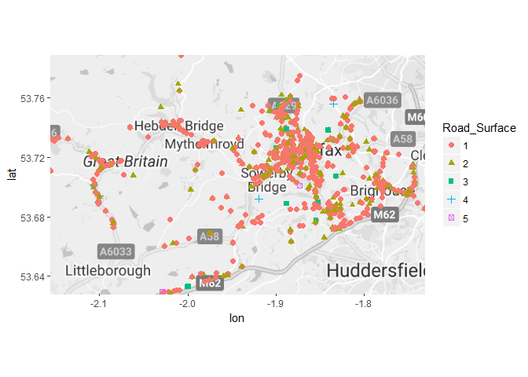
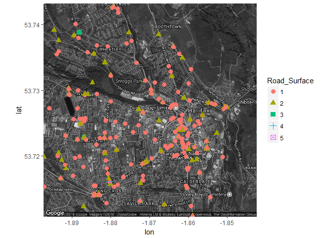
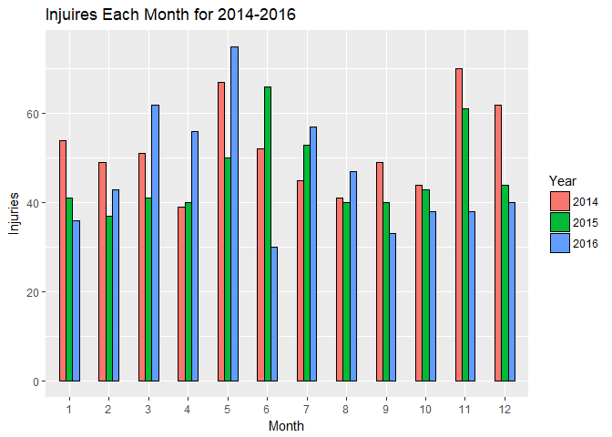
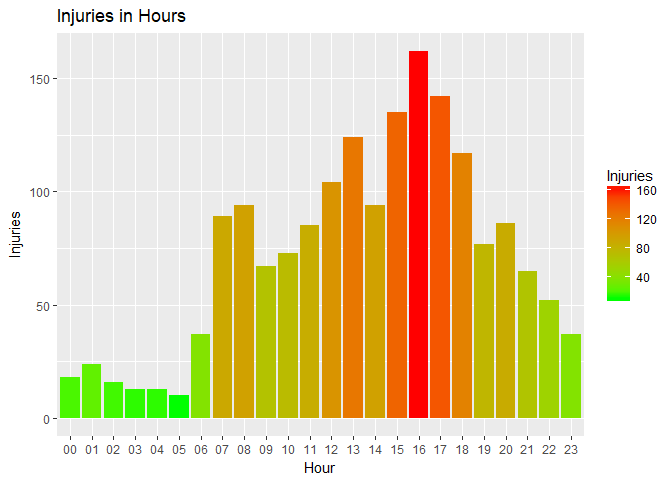
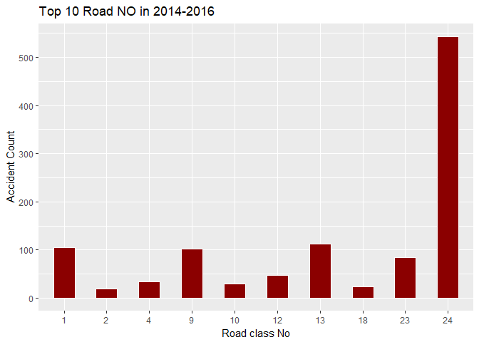
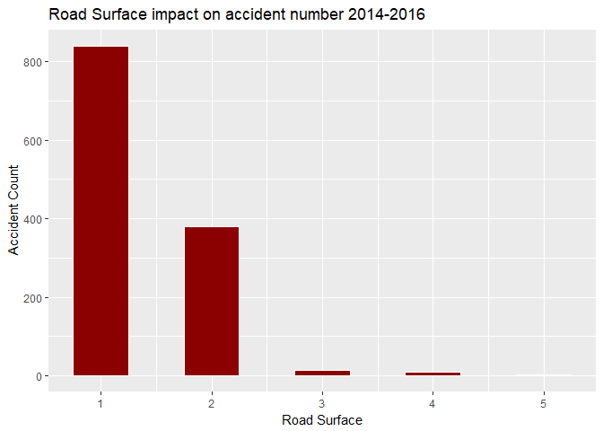
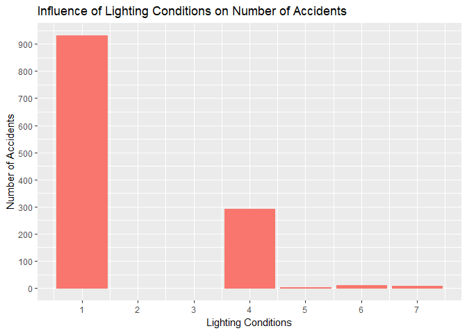
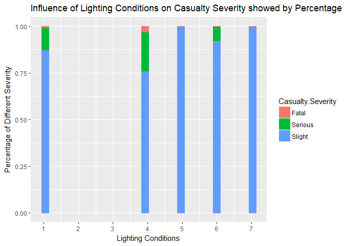
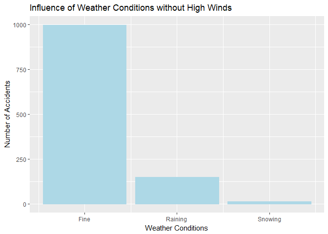
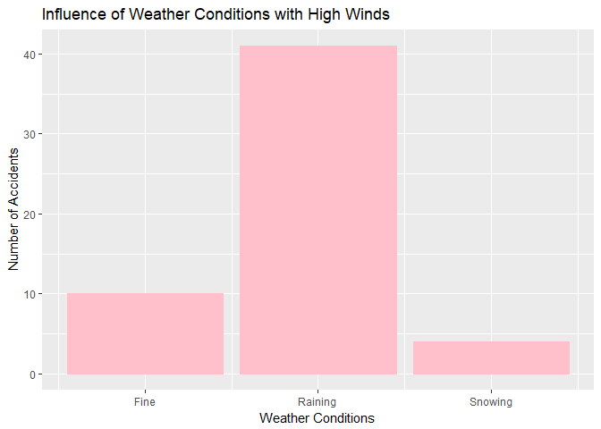

Data Analysis on UK Car Accidents & Injuries
================
Kaixiang Huang, Yanqi Huang, Xinyi Hou, Xinhui Peng, Aiwei Li
April 23, 2018

Introduction, Objective and Motivation
--------------------------------------

Road traffic safety has always been a paramount concern in our daily life. It is reported that about 1,250,000 people were killed by traffic-related accidents in 2015 \[1\]. The objective of the project is to analyze the data of car accidents at certain area in UK from 2014 to 2016 and to figure out useful insights from the data graphically. Factors like time period, road conditions, lighting conditions, and sex etc. might be correlated with the frequency of accidents. We attempt to find these correlations and make recommendations for improving road safety. The dataset is published by UK Department for Transportation \[2\] and available from our Github repository \[3\].

Statistical Insights
--------------------

### Locations vs. Accidents & Injuries

``` r
accident14 = read.csv('Accident 2014.csv')
accident15 = read.csv('Accident 2015.csv')
accident16 = read.csv('Accident 2016.csv')
accident_all = rbind(accident14,accident15,accident16)
library(dplyr)
library(rgdal)
library(proj4)
#Accident in 2014
coords14 = cbind(long = as.numeric(as.character(accident14$Grid.Ref..Easting)),
               lat = as.numeric(as.character(accident14$Grid.Ref..Northing)))
GP_SP14 = SpatialPoints(coords14,proj4string = CRS("+init=epsg:27700"))
GP_SP_LL14 = spTransform(GP_SP14,CRS("+init=epsg:4326"))
longlat14=as.data.frame(GP_SP_LL14)

#Accident in 2015
coords15 = cbind(long = as.numeric(as.character(accident15$Grid.Ref..Easting)),
                 lat = as.numeric(as.character(accident15$Grid.Ref..Northing)))
GP_SP15 = SpatialPoints(coords15,proj4string = CRS("+init=epsg:27700"))
GP_SP_LL15 = spTransform(GP_SP15,CRS("+init=epsg:4326"))
longlat15=as.data.frame(GP_SP_LL15)
#Accident in 2016 
coords16 = cbind(long = as.numeric(as.character(accident15$Grid.Ref..Easting)),
                 lat = as.numeric(as.character(accident15$Grid.Ref..Northing)))
GP_SP16 = SpatialPoints(coords16,proj4string = CRS("+init=epsg:27700"))
GP_SP_LL16 = spTransform(GP_SP16,CRS("+init=epsg:4326"))
longlat16=as.data.frame(GP_SP_LL16)
longlat16=head(longlat16,555)
#combine the data for three years 
longlat = rbind(longlat14,longlat15,longlat16)
longlat = mutate(longlat,Road_Surface = accident_all$Road.Surface)
longlat$Road_Surface=as.factor(longlat$Road_Surface)
#Plot UK map 
library(ggplot2)
library(dplyr)
library(maps)
library(ggmap)
library(knitr)
opts_knit$set(eval.after = 'fig.cap')
UK_map_overview= get_map(location = c(mean(longlat$long),mean(longlat$lat)), zoom =10,maptype='roadmap', color='bw')
UK_map_Halifax= get_map(location = c(-1.87,53.7270), zoom =14,maptype='hybrid', color='bw')
```

``` r
ggmap(UK_map_overview)+ geom_point(data=longlat,aes(x=long,y=lat,shape=Road_Surface,color=Road_Surface),size=2)+
  scale_x_continuous(limits=c(min(longlat$long),max(longlat$long)),expand=c(0,0))+
  scale_y_continuous(limits=c(min(longlat$lat),max(longlat$lat)),expand=c(0,0))
```



Figure 1: Overview of car accident locations on UK map

``` r
ggmap(UK_map_Halifax)+geom_point(data=longlat,aes(x=long,y=lat,shape=Road_Surface,color=Road_Surface),size=3)
```



Figure 2. Accident locations on Halifax

Figure 1 shows the overview of car accident locations on UK map. Since the data is a small sample queried from the whole accident record in UK, only a small region of UK is exhibited. Figure 2 gives a closer look at the accident distribution in a city, which is Halifax we choose. From Figure 1 we can see that the locations are denser around cities than on highways. The frequency of accident is different from highways to highways as well, as we can see that A6033 is obviously having more accidents than other highways. From Figure 2 we can see that the locations are denser around downtown than suburban area. From the perspective of road condition, we can see that the majority of accidents occur on a dry road. Wet/damp road takes a small portion, but accidents rarely occur on snowy, frosty and floody days.

### Time vs. Accidents & Injuries

``` r
library(lubridate)
library(ggplot2)
library(dplyr)
library(stringr)

accident=rbind(accident14,accident15,accident16)
accident$Accident.Date=dmy(accident$Accident.Date)
accident$Year=year(accident$Accident.Date)
accident$Month=month(accident$Accident.Date)

accident$Year=as.factor(accident$Year)
accident$Month=as.factor(accident$Month)

Year=c("2014","2015","2016")
Accidents=c(427,410,407)
Injuries=c(623,556,555)
table=data.frame(Year,Accidents,Injuries)
```

``` r
ggplot(accident,aes(x=Month,fill=Year))+geom_bar(position="dodge",color="black",width=0.5)+
  ggtitle("Injuires Each Month for 2014-2016")+ylab("Injuries")
```



Chart 1: Injuries in Each Month for 2014-2016

``` r
accident %>% filter(Year==2014) %>% summarise(n_distinct(Reference.Number))
accident %>% filter(Year==2015) %>% summarise(n_distinct(Reference.Number))
accident %>% filter(Year==2016) %>% summarise(n_distinct(Reference.Number))
accident %>% filter(Year==2014) %>% summarise(n())
accident %>% filter(Year==2015) %>% summarise(n())
accident %>% filter(Year==2016) %>% summarise(n())

Year=c("2014","2015","2016")
Accidents=c(427,410,407)
Injuries=c(623,556,555)
table=data.frame(Year,Accidents,Injuries)
```

| Year |  Accidents|  Injuries|
|:-----|----------:|---------:|
| 2014 |        427|       623|
| 2015 |        410|       556|
| 2016 |        407|       555|

Table 1: Number of Car Accidents and Injuries 2014-2016

Chart 1 shows the number of injuries in each month in the form of bar chart, and months in different years are grouped and compared. In 2014, May, November and December are top 3 months with most injuries; in 2015, the top 3 are June, July and December; in 2016, March, May and July have more injuries than other months. In conclusion, the chart is showing a trend that the number of injuries are relatively higher in summer and winter season. The hypothesis that the number of car accidents in holiday season could be higher is acceptable. The reason could be that more people choose to travel during holidays thus higher number of vehicles on the road.

``` r
names(accident)[6]=paste("Time.24hr")
accident$Time.24hr=str_pad(accident$Time.24hr,width = 4,side=c("left"),pad="0")
accident$Hour=substr(accident$Time.24hr,start=1,stop=2)
ggplot(accident,aes(x=Hour,fill=..count..))+geom_bar()+ggtitle("Injuries in Hours")+
    ylab("Injuries")+xlab("Hour")+scale_fill_gradient("Injuries",low='green',high='red')
```



Chart 2: Cumulative Injuries in Different Hours

Chart 2 shows the cumulative injuries in different hours in a daily time-slot. The first observation is that there are more accidents and injuries in daily hours, from 7:00am to 22:00pm. More specifically, 7am-8am, 12pm-13pm, 3pm-6pm are time period that have relatively higher number of injuries. These three time-slot are morning peak, lunch break and evening peak respectively, which indicates that the hypothesis of more accidents during peak hours is acceptable.

### Road Information vs. Car Accidents and Injuries

``` r
accident$Accident.Date=dmy(accident$Accident.Date)
accident$year=year(accident$Accident.Date)
accident$month=month(accident$Accident.Date)
accident$year=as.factor(accident$year)
accident$month=as.factor(accident$month)
accident$X1st.Road.Class...No=as.numeric(accident$X1st.Road.Class...No)
accident$Casualty.Severity=as.numeric(accident$Casualty.Severity)
class(accident$year)
accident_unique=accident%>%distinct(Reference.Number,.keep_all=T)
```

``` r
Countroadnumber=accident_unique%>%group_by(X1st.Road.Class...No)%>%summarise(countnumber=n())
top10roadnumber=Countroadnumber%>%arrange(desc(countnumber))%>%slice(1:10)
ggplot(top10roadnumber,aes(x=as.factor(X1st.Road.Class...No),y=countnumber))+geom_bar(stat="identity",position="dodge",color="white",fill="darkred",width=0.5)+xlab("Road class No")+
  ylab("Accident Count") +ggtitle("Top 10 Road NO in 2014-2016")+scale_y_continuous(breaks=c(0,100,200,300,400,500))
```



Chart 3: Top 10 road numbers with accident count

Chart 3 shows the top 10 road number s with accident count. Road 24 has the highest accident count from 2014-2016. Road 1,9,13,23 also has relative high accidents count. There may have several reason why these road has high accidents rates. First, the road may have big traffic volume, when the traffic volume increase, the number of accidents also increase. Secondly, some parts of these road are easily to trig accident. Such as, there has sharp turn or bad road condition.

``` r
ggplot(accident_unique,aes(x= Road.Surface))+geom_histogram(binwidth = 0.5,color="white",fill="darkred")+xlab("Road Surface") +
  ylab("Accident Count") +ggtitle("Road Surface impact on accident number 2014-2016")
```



Chart 4: Road surface conditions vs. accident count

| Road Surface | Conditions                         |
|:-------------|:-----------------------------------|
| 1            | Dry                                |
| 2            | Wet/Damp                           |
| 3            | Snow                               |
| 4            | Frost/Ice                          |
| 5            | Flood(surface water over 3cm deep) |

Table 2: Guidance for road surface conditions.

Our hypothesis of road surface condition and accident count are that worse road condition has higher accident count. However, as what we can tell from Chart 4, that the dry road surface actually has the highest accident count. We think the reason of this is because, there has more time of year are sunny or at least no rain. If 80% of the time the road is dry, then although the wet road condition may have higher possibility of accident, the total accident accounts should still lower than the dry condition.

### Lighting Conditions vs. Car Accidents and Injuries

| Lighting Conditions | Lighting Conditions Desc                  |
|:--------------------|:------------------------------------------|
| 1                   | Daylight: street lights present           |
| 2                   | Daylight: no street lighting              |
| 3                   | Daylight: street lighting unknown         |
| 4                   | Darkness: street lights present and lit   |
| 5                   | Darkness: street lights present but unlit |
| 6                   | Darkness:no street lighting               |
| 7                   | Darkness:street lighting unknown          |

Table 3: Guidance for Lighting Conditions

``` r
ggplot(accident_unique, aes(Lighting.Conditions,color="light red",fill="light red")) + 
  geom_bar()+xlab("Lighting Conditions")+ylab("Number of Accidents")+
  ggtitle("Influence of Lighting Conditions on Number of Accidents")+guides(fill=F,color=F)+
  scale_y_continuous(breaks=seq(0,900,100))+
  scale_x_continuous(breaks=seq(1,7,1))
```



Chart 5: Influence of Lighting Conditions on Number of Accidents

Our initial hypothesis is that among the accidents that occur, bad lighting conditions have larger portion. However, the barplot shows that most of the accidents occurred when there was daylight with street lights present which is the brightest. Therefore, darkness does not necessarily lead to car accidents.

``` r
mode(accident$Casualty.Severity)
accident$Casualty.Severity= as.factor(accident$Casualty.Severity)
levels(accident$Casualty.Severity) = c("Fatal","Serious","Slight")
ggplot(accident, aes(x=Lighting.Conditions,color=Casualty.Severity,fill=Casualty.Severity)) + 
  geom_histogram(position = "fill")+xlab("Lighting Conditions")+
  ylab("Percentage of Different Severity")+
  ggtitle("Influence of Lighting Conditions on Casualty Severity showed by Percentage")+
  scale_x_continuous(breaks=seq(1,7,1))
```



Chart 6: Influence of Lighting Conditions on Casualty Severity showed by Percentage

The percentage of different casualty severity fluctuates as the lighting conditions getting worse. Hence, we argue that there is no correlation between casualty severity and lighting conditions.

| Weather Conditions | Weather Conditions Desc    |
|:-------------------|:---------------------------|
| 1                  | Fine without high winds    |
| 2                  | Raining without high winds |
| 3                  | Snowing without high winds |
| 4                  | Fine with high winds       |
| 5                  | Raining with high winds    |
| 6                  | Snowing with high winds    |
| 7                  | Fog or mist n if hazard    |
| 8                  | Other                      |
| 9                  | Unknown                    |

Table 4: Guidance for Weather Conditions

``` r
wo_high_wind = accident_unique %>% filter(Weather.Conditions %in% c(1,2,3)) %>% summarise(n())
with_high_wind = accident_unique %>% filter(Weather.Conditions %in% c(4,5,6)) %>% summarise(n())
wind_table = data.frame(wo_high_wind,with_high_wind)
colnames(wind_table)=c('Without High Winds','With High Winds')
kable(wind_table[1:1,])
```

|  Without High Winds|  With High Winds|
|-------------------:|----------------:|
|                1158|               55|

Table 5: Number of Car Accidents with/without High Winds

As for Weather Conditions, 1 to 3 represents conditions without high winds and 4 to 6 stands for the opposite. The table shows that 1158 accidents happened without high winds. 55 accidents happened with high winds. We conclude that high wind is not a factor that causes more accidents.

``` r
accident_unique %>% filter(Weather.Conditions %in% c(1,2,3)) %>% 
  ggplot(aes(x=Weather.Conditions))+geom_bar(color="light blue",fill="light blue")+
  scale_x_continuous(breaks=seq(1,3,1),label=c("Fine","Raining","Snowing"))+
  labs(x="Weather Conditions",y="Number of Accidents",title="Influence of Weather Conditions without High Winds")
```



Chart 7: Influence of Weather Conditions without High Winds

``` r
accident_unique %>% filter(Weather.Conditions %in% c(4,5,6)) %>% 
  ggplot(aes(x=Weather.Conditions))+geom_bar(color="pink",fill="pink")+
  scale_x_continuous(breaks=seq(4,6,1),label=c("Fine","Raining","Snowing"))+
  labs(x="Weather Conditions",y="Number of Accidents",title="Influence of Weather Conditions with High Winds")
```



Chart 8: Influence of Weather Conditions with High Winds

As we can see, when there was no high winds, raining and snowing did not cause more accidents. Conversely, most of the accidents happened when the weather is fine without high winds. If there was high winds, the number of accidents in raining days did increase by almost four times than the fine days. However, snowing days did not show such pattern.

### Gender, Casulty Class vs. Injuries

``` r
Car2014=read.csv("Accident 2014.csv")
Car2015=read.csv("Accident 2015.csv")
Car2016=read.csv("Accident 2016.csv")

Car2014 %>% filter(Casualty.Class==1,Sex.of.Casualty==1) %>% summarise(MaleAccidents=n())
Car2014 %>% filter(Casualty.Class==1,Sex.of.Casualty==2) %>% summarise(FemaleAccidents=n())
Car2015 %>% filter(Casualty.Class==1,Sex.of.Casualty==1) %>% summarise(MaleAccidents=n())
Car2015 %>% filter(Casualty.Class==1,Sex.of.Casualty==2) %>% summarise(FemaleAccidents=n())
Car2016 %>% filter(Casualty.Class==1,Sex.of.Casualty==1) %>% summarise(MaleAccidents=n())
Car2016 %>% filter(Casualty.Class==1,Sex.of.Casualty==2) %>% summarise(FemaleAccidents=n())
MaleAccidents = c(247,223,203)
FemaleAccidents =c(104,112,111)
Year=c(2014,2015,2016)
SexOfAccidents = data.frame(Year,MaleAccidents,FemaleAccidents)
```

|  Year|  MaleAccidents|  FemaleAccidents|
|-----:|--------------:|----------------:|
|  2014|            247|              104|
|  2015|            223|              112|
|  2016|            203|              111|

Table 8. Male injuries vs. female injuries from 2014 to 2016.

``` r
Car2014 %>% filter(Casualty.Class==1) %>% summarise(DriverCasualty=n())
Car2014 %>% filter(Casualty.Class==2) %>% summarise(PassengerCasualty=n())
Car2014 %>% filter(Casualty.Class==3) %>% summarise(PedestrianCasualty=n())

Car2015 %>% filter(Casualty.Class==1) %>% summarise(DriverCasualty=n())
Car2015 %>% filter(Casualty.Class==2) %>% summarise(PassengerCasualty=n())
Car2015 %>% filter(Casualty.Class==3) %>% summarise(PedestrianCasualty=n())

Car2016 %>% filter(Casualty.Class==1) %>% summarise(DriverCasualty=n())
Car2016 %>% filter(Casualty.Class==2) %>% summarise(PassengerCasualty=n())
Car2016 %>% filter(Casualty.Class==3) %>% summarise(PedestrianCasualty=n())

DriverCasualty=c(351,335,314)
PassengerCasualty=c(175,119,138)
PedestrianCasualty=c(97,102,103)
ClassOfCasualty = data.frame(Year,DriverCasualty,PassengerCasualty,PedestrianCasualty)
```

|  Year|  DriverCasualty|  PassengerCasualty|  PedestrianCasualty|
|-----:|---------------:|------------------:|-------------------:|
|  2014|             351|                175|                  97|
|  2015|             335|                119|                 102|
|  2016|             314|                138|                 103|

Table 9. Injuries for each casualty class from 2014 to 2016.

We are interested in exploring what gender and casualty class are more vulnerable to car accidents. From Table 7 we can see that male injuries are almost twice as female injuries. We offer two possible explanations: First, the majority of the vehicle participants is male, placing them into a more vulnerable position; second, male drivers are more reckless and prone to speeding, drunk-driving, text-driving etc., compared to female drivers. From Table 8 we can see that driver is in the most vulnerable position in terms of the casualty class; pedestrian is the least possible to get hurt in an accident. We speculate that the majority of car accidents is car crash, so the driver is the most susceptible to be injured, while the case that a car running into a pedestrian is rare. This raises concern on enhancing vehicle safety to protect drivers for auto-manufacturers.

Diagnosis and Recommendation
----------------------------

Our analysis provides useful insights on improving road safety as well as mitigating casualties. Some specific highways have a higher rate of car accidents, so we recommend Department of Transportation to increase warning signs and improving road conditions at dangerous regions along the road. There are more car accidents happening in holiday and winter season in a year and peak hours during a day, so we recommend for improving the road planning, optimize the routing, performing road repairing during non-busy hours, increasing forces on regulating the traffic. In addition, raining days with high winds is extremely dangerous, driving is not recommended.

Limitations
-----------

Although we obtain insightful information from the data, we need more evidence to validate our initial conclusion. Due to the limited size and content of the provided data, we are insufficient to make certain arguments. For example, we cannot simply conclude that there is no correlation between road surface and accident rate, from the fact that the majority of accidents happen on good road condition. This is because you rarely encounter bad road condition in a well-developed country like UK. Similar acknowledgement can be made upon factors like lighting conditions, weather conditions. In order to reinforce our arguments, we need to modify our methodology. For example, to study topic like “whether rainy days will trigger more accidents”, we need to compare the average amount of accidents in fine days with the average amount of accidents in rainy days.

Reference
---------

\[1\] <https://en.wikipedia.org/wiki/List_of_countries_by_traffic-related_death_rate>
\[2\] <https://www.gov.uk/government/collections/road-accidents-and-safety-statistics>
\[3\] <https://github.com/hkxxswz8/UK-Car-Accidents-2014-2016.git>
