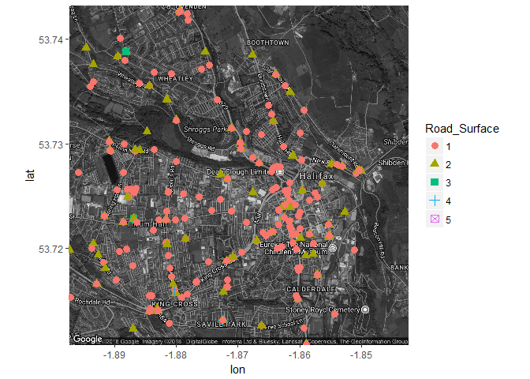

Data Analysis on UK Car Accidents & Injuries
================
Kaixiang Huang, Yanqi Huang, Xinyi Hou, Xinhui Peng, Aiwei Li
April 23, 2018

Introduction, Objective and Motivation
--------------------------------------

Road traffic safety has always been a paramount concern in our daily life. It is reported that about 1,250,000 people were killed by traffic-related accidents in 2015 \[1\]. The objective of the project is to analyze the data of car accidents at certain area in UK from 2014 to 2016 and to figure out useful insights from the data graphically. Factors like time period, road conditions, lighting conditions, and sex etc. might be correlated with the frequency of accidents. We attempt to find these correlations and make recommendations for improving road safety. The dataset is published by UK Department for Transportation \[2\] and available from our Github repository \[3\].

Statistical Insights
--------------------

``` r
accident14 = read.csv('Accident 2014.csv')
accident15 = read.csv('Accident 2015.csv')
accident16 = read.csv('Accident 2016.csv')
accident_all = rbind(accident14,accident15,accident16)
library(dplyr)
library(rgdal)
library(proj4)
#Accident in 2014
coords14 = cbind(long = as.numeric(as.character(accident14$Grid.Ref..Easting)),
               lat = as.numeric(as.character(accident14$Grid.Ref..Northing)))
GP_SP14 = SpatialPoints(coords14,proj4string = CRS("+init=epsg:27700"))
GP_SP_LL14 = spTransform(GP_SP14,CRS("+init=epsg:4326"))
longlat14=as.data.frame(GP_SP_LL14)

#Accident in 2015
coords15 = cbind(long = as.numeric(as.character(accident15$Grid.Ref..Easting)),
                 lat = as.numeric(as.character(accident15$Grid.Ref..Northing)))
GP_SP15 = SpatialPoints(coords15,proj4string = CRS("+init=epsg:27700"))
GP_SP_LL15 = spTransform(GP_SP15,CRS("+init=epsg:4326"))
longlat15=as.data.frame(GP_SP_LL15)
#Accident in 2016 
coords16 = cbind(long = as.numeric(as.character(accident15$Grid.Ref..Easting)),
                 lat = as.numeric(as.character(accident15$Grid.Ref..Northing)))
GP_SP16 = SpatialPoints(coords16,proj4string = CRS("+init=epsg:27700"))
GP_SP_LL16 = spTransform(GP_SP16,CRS("+init=epsg:4326"))
longlat16=as.data.frame(GP_SP_LL16)
longlat16=head(longlat16,555)
#combine the data for three years 
longlat = rbind(longlat14,longlat15,longlat16)
longlat = mutate(longlat,Road_Surface = accident_all$Road.Surface)
longlat$Road_Surface=as.factor(longlat$Road_Surface)
#Plot UK map 
library(ggplot2)
library(dplyr)
library(maps)
library(ggmap)
```


